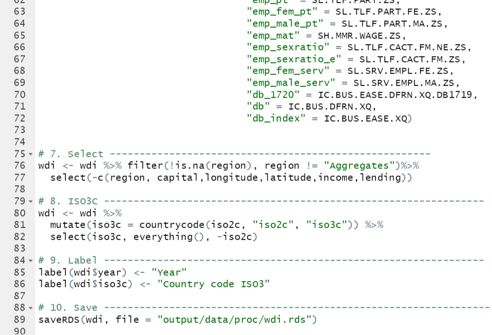
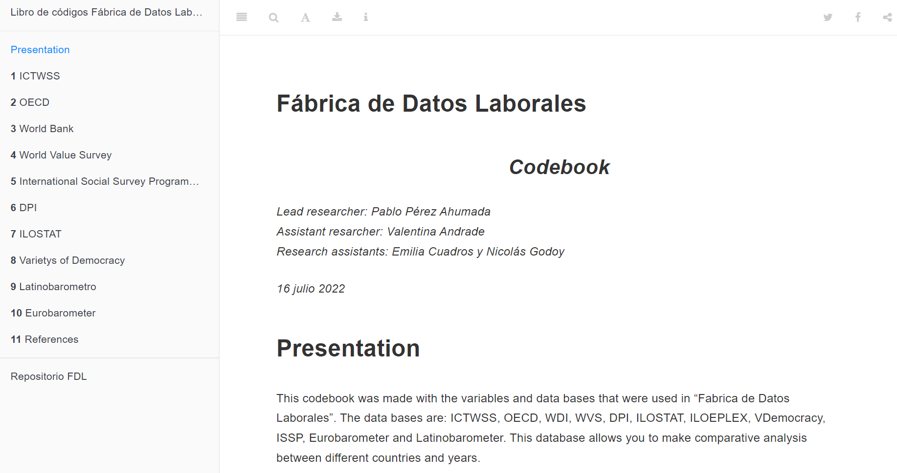

background-image: url("assets/logo/logo.png")
background-size: 15%
background-position: 100% 0%

```{r, load_refs, echo=FALSE, cache=FALSE, message=FALSE, warning=F}
# library(RefManageR)
# BibOptions(check.entries = FALSE, 
#            bib.style = "authoryear", 
#            cite.style = 'authoryear', 
#            style = "markdown",
#            hyperlink = FALSE, 
#            dashed = FALSE)
# myBib <- ReadBib("assets/example.bib", check = FALSE)
library(icons)
top_icon = function(x) {
  icons::icon_style(
    icons::fontawesome(x),
    position = "fixed", top = 10, right = 10
  )
}

library(tidyverse)
library(knitr)
library(kableExtra)
```

## Motivación 

<br>

- Dificultades del **análisis comparado** en torno a las _relaciones industriales_ y el _conflicto capital-trabajo_

<br>

--

.content-box-red[

- **Multidimensionalidad** de los fenómenos

- **Multiplicidad** de fuentes

- **Escasez** y **dificultad** para hallar indicadores

]
---
background-image: url("assets/logo/logo.png")
background-size: 15%
background-position: 100% 0%

## ¿Qué se abordará en esta presentación?

<br>
<br>
<br>

--

- ¿**Por qué** construir una base de datos como esta?

--

- **Fuentes** de información incorporadas

--

- **Procesamiento**

--

- Algunos **análisis**

--

- Libro de **códigos**

---
background-image: url("assets/logo/logo.png")
background-size: 15%
background-position: 100% 0%

class: center, middle

# ¿Por qué construir FDL?
---
background-image: url("assets/logo/logo.png")
background-size: 15%
background-position: 100% 0%

## ¿Por qué construir FDL?

<br><br><br><br>

- **Objetivo**: comparar patrones de conflicto *objetivo* y *subjetivo* en **Argentina** y **Chile**
- Diseño cualitativo y cuantitativo
 + *Estudios de caso*
 + Construcción de *base de datos internacional*
- Vincular el estudio de América Latina a los debates internacionales sobre *clases*, *relaciones laborales* y *conflicto laboral*

---

background-image: url("assets/logo/logo.png")
background-size: 15%
background-position: 100% 0%

class: center, middle

# Fuentes de información

---

background-image: url("assets/logo/logo.png")
background-size: 15%
background-position: 100% 0%

```{r echo=FALSE}
fuente = c("Institutional Characteristics of Trade Unions, Wage Setting, State Intervention and Social Pacts",
            "Organización para la Cooperación y el Desarrollo Económicos",
            "World Development Indicators",
            "World Value Survey",
            "Database of Political Institutions",
            "International Social Survey Programme",
            "ILO-EPLex",
            "ILO-Stat",
            "Varieties of Democracy",
            "Latinobarómetro",
            "Eurobarometer")
abr = c("ICTWSS",
        "OCDE",
        "WDI",
        "WVS",
        "DPI",
        "ISSP",
        "",
        "",
        "V-Dem",
        "",
        "")

a = c("X", 
      "",
      "",
      "X",
      "",
      "X",
      "",
      "X",
      "",
      "",
      "")
b = c("",
      "",
      "",
      "",
      "X",
      "",
      "",
      "",
      "X",
      "X",
      "X")
c = c("X",
      "",
      "",
      "",
      "",
      "",
      "",
      "",
      "",
      "",
      "")
d = c("X",
      "X",
      "X",
      "",
      "",
      "",
      "X",
      "X",
      "X",
      "",
      "")

x <- data.frame(fuente, abr, a, b,  c, d)

x %>% 
  knitr::kable(col.names = c("Fuente",
                          "Abreviación",
                          "Asociaciones sociales y políticas",
                          "Democracia y Sistema Sociopolítico",
                          "Pactos y acuerdos",
                          "Relaciones económicas y de empleo")) %>% 
  kableExtra::kable_classic_2()

```
---
background-image: url("assets/logo/logo.png")
background-size: 15%
background-position: 100% 0%

## Fuentes de información (ejemplos)

- **ICTWSS**: *negociación* de salarios, *densidad sindical*

--

- **OCDE**: *empleo* por sector, género, indicadores de *crecimiento* económico

--

- **WDI**: *población y fuerza de trabajo*, *Ease of Doing Business Index*

--

- **WVS**: *confianza* en actores sindicales y *participación* sindical

--

- **DPI**: *sistema electoral*, características del *gobierno*

--

- **ISSP**: *Identidad* de clase y percepción de *conflicto* de clase

--

- **ILO-EPLex**: *protección* a trabajadores, *regulación* de conflicto laboral

--

- **ILO-Stat**: *fuerza de trabajo*, *productividad*, *condiciones* salariales, *conflicto* laboral

--

- **V-Dem**: nivel de *participación política*, características de *sistemas e instituciones* políticas

--

- **Latinobarómetro**: actitudes hacia la *justicia distributiva*, percepción de *poder y confianza* en diversos actores, percepciones de *conflicto* de clase

--

- **Eurobarómeter**: percepciones sobre *conflicto* de clase y *orientaciones* valóricas

---

background-image: url("assets/logo/logo.png")
background-size: 15%
background-position: 100% 0%

class: center, middle

# Procesamiento de datos

---
background-image: url("assets/logo/logo.png")
background-size: 15%
background-position: 100% 0%

## Procesamiento de datos

- Procedimientos estandarizados y **reproducibles** en R
 + Descarga: evitar descarga local de datos a través de **webscrapping**
 + Transformación de estructura de datos
 + Transformación de variables
 + Estimación a nivel agregado para datos de encuestas
 + Integración
 + Etiquetado automático 
 + Unificación final y asignación de nomenclatura

- Un código por fuente + códigos de integración 
- Todo disponible en [https://github.com/fabrica-datos-laborales/fdl-data](https://github.com/fabrica-datos-laborales/fdl-data) `r icons::icon_style(icons::fontawesome("github"))`

---
background-image: url("assets/logo/logo.png")
background-size: 15%
background-position: 100% 0%

## Procesamiento de datos

```{r echo=FALSE, out.height = "550px"}
knitr::include_graphics("img/code_alast_1.png")
```
---

background-image: url("assets/logo/logo.png")
background-size: 15%
background-position: 100% 0%

## Procesamiento de datos

```{r echo=FALSE, out.height= "550px"}

```

---
background-image: url("assets/logo/logo.png")
background-size: 15%
background-position: 100% 0%

class: center, middle

# Algunos análisis

---
background-image: url("assets/logo/logo.png")
background-size: 15%
background-position: 100% 0%

## Algunos análisis

<br><br><br><br>

.content-box-red[
- **Ease of Doing Business Score** (db_wdi) y **Densidad sindical** (tud_ilostat)
- **Salario mínimo en relación al salario mediano** (mrw_oecd) e **Intervención del gobierno en negociaciones salariales** (govint_ictwss)
- **Salario nominal medio por hora para empleadas mujeres** (hourearn_fem_isco08_total_ilostat) e **Índice de Empoderamiento Político Femenino**
]

---
background-image: url("assets/logo/logo.png")
background-size: 15%
background-position: 100% 0%

## Libro de códigos

<br>

- Bookdown disponible en [https://github.com/fabrica-datos-laborales/fdl-data/tree/main/codebook](https://github.com/fabrica-datos-laborales/fdl-data/tree/main/codebook) `r icons::icon_style(icons::fontawesome("github"))`

.content-box-red[
- Una página por fuente de datos. Cada una incluye
 + **Descripción** de los datos extraídos
 + Tabla con información sobre
  + **Nombre** de las variables en los datos
  + **Concepto** y **definición**
  + **Rango** de valores
  + **Tipo** de dato
  + **Clasificación**

]
---
background-image: url("assets/logo/logo.png")
background-size: 15%
background-position: 100% 0%

## Libro de códigos

```{r echo=FALSE, out.height = "550px"}

```

---
background-image: url("assets/logo/logo.png")
background-size: 15%
background-position: 100% 0%

## Libro de códigos

```{r echo=FALSE, out.height = "550px"}
knitr::include_graphics("img/bookdown-alast2022_2.png")
```

---

class: fdl-black
background-image: url("assets/logo/logo-blanco.png")
background-size: 15%
background-position: 100% 0%

# ¡Gracias!

.pull-right[.pull-down[

.white[**Pablo Pérez Ahumada** - Investigador principal]
<a href="mailto:pperez@uahurtado.cl">
.white[`r icons::icon_style(icons::fontawesome("paper-plane"), fill = "white")` pperez@uahurtado.cl]
</a>

<a href="https://fabricadedatoslaborales.cl/">
.white[`r icons::icon_style(icons::fontawesome("link"), fill = "white")` https://fabricadedatoslaborales.cl]
</a>

<a href="http://github.com/fabrica-datos-laborales">
.white[`r icons::icon_style(icons::fontawesome("github"), fill = "white")` @fabrica-datos-laborales]
</a>

<br>
.white[**Valentina Andrade** - Asistente de investigación]
<a href="mailto:valentinaandrade@uchile.cl">
.white[`r icons::icon_style(icons::fontawesome("paper-plane"), fill = "white")` valentinaandrade@uchile.cl]
</a>


<a href="https://github.com/valentinaandrade">
.white[`r icons::icon_style(icons::fontawesome("github"), fill = "white")` @valentinaandrade]
</a>

<br>

.white[*Nicolás Godoy* - Tesista de pregrado]
<a href="mailto:nicolas.godoy.m@ug.uchile.cl">
.white[`r icons::icon_style(icons::fontawesome("paper-plane"), fill = "white")` nicolas.godoy.m@ug.uchile.cl]
</a>


<a href="https://github.com/nicolasggodoym">
.white[`r icons::icon_style(icons::fontawesome("github"), fill = "white")` @nicolasggodoym]
</a>


]]

.pull-left.white.middle[
FONDECYT N°11190229<br>*Determinantes institucionales y políticos del conflicto entre empresarios y trabajadores: los casos de Argentina y Chile en perspectiva comparada*]